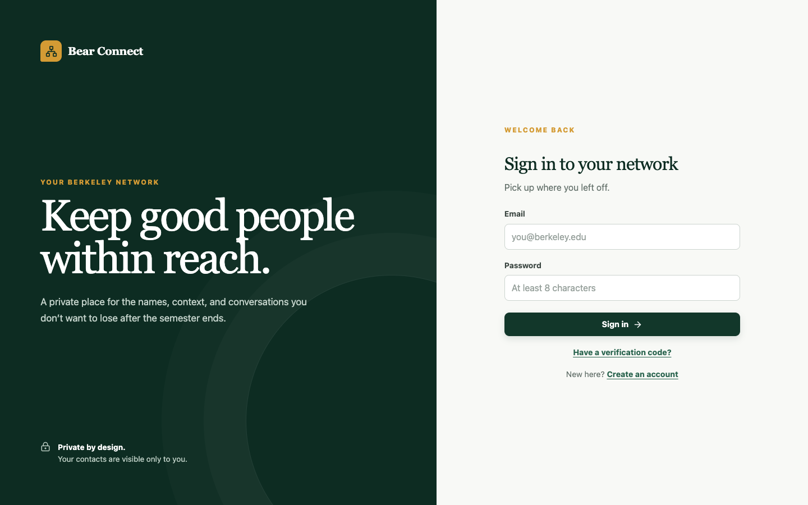
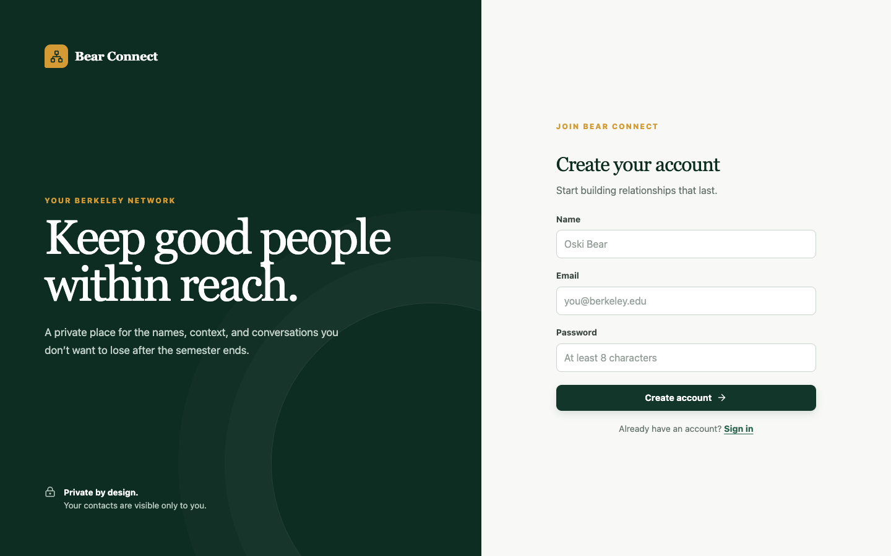
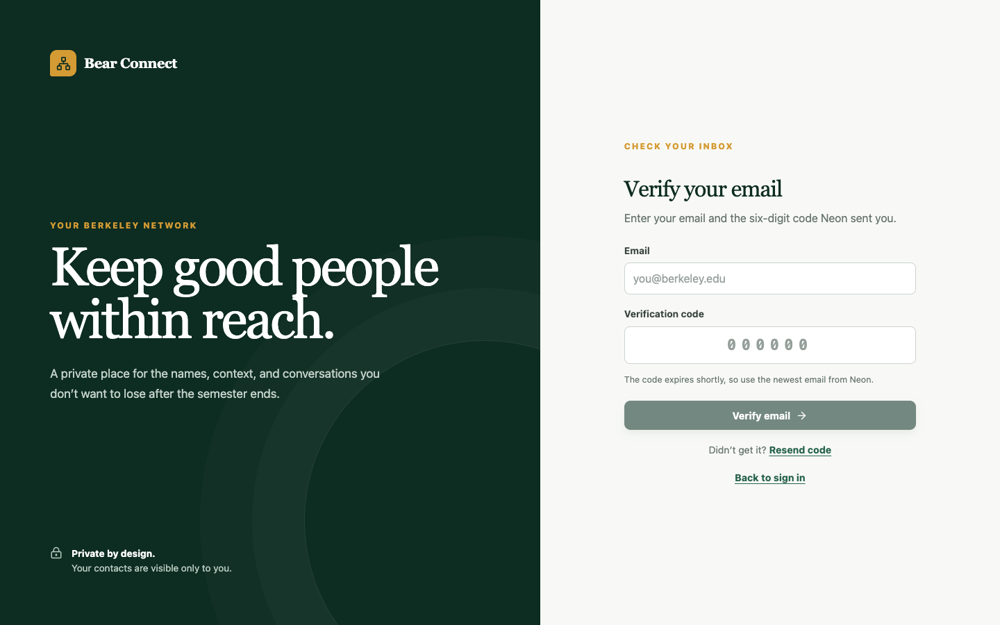

# Bear Connect — Secure Networking Tracker

Bear Connect is a private relationship tracker for Berkeley students and community members. A signed-in user can record who they met, where they met, the person’s company and role, private notes, and a follow-up priority. The responsive React interface communicates with Node.js API functions, Neon Managed Auth provides verified email/password accounts and sessions, and PostgreSQL Row Level Security (RLS) ensures each user can access only their own contacts.

- **Live application:** [https://networking-tracker-tan.vercel.app](https://networking-tracker-tan.vercel.app)
- **Public repository:** [https://github.com/tess-rubin/networking-tracker](https://github.com/tess-rubin/networking-tracker)

## Screenshots

### Sign in

The opening screen lets an existing user sign in or move to account creation or email verification.



### Create an account

New users enter their name, email address, and password before confirming their email.



### Verify an email address

Users can enter the six-digit code sent by Neon, request a new code, or return to sign in.



## Product walkthrough

1. Select **Create an account**, enter a name, email, and password, and submit the six-digit email verification code. Existing users can select **Have a verification code?** if they need to resume verification.
2. After sign-in, the dashboard restores the authenticated session and loads only that user’s contacts.
3. Select **Add contact** and record a name, company, role, where the introduction happened, notes, and a high/medium/low priority.
4. Search across name, company, role, and meeting place; filter by priority; or sort by name, company, role, priority, or most recent update.
5. Edit a saved contact or delete it through an accessible confirmation dialog. Data persists in Neon after refresh, sign-out, and later sign-in.
6. On smaller screens the desktop table becomes touch-friendly contact cards with the same actions and information.

## Features

- Email/password signup, six-digit email verification, sign-in, session restoration, and sign-out
- Authenticated create, read, update, and delete operations for contacts
- Server-side search, priority filtering, and allowlisted sorting
- Responsive desktop table and mobile card layouts
- Loading skeletons, empty states, filtered-no-results states, inline validation, success toasts, and safe error messages
- Shared Zod validation in the browser-facing API contract and Node.js functions
- PostgreSQL constraints, update timestamp trigger, supporting indexes, and per-operation RLS policies
- Strict rejection of browser-supplied ownership fields such as `userId`
- Deterministic Vitest coverage plus an opt-in live two-account RLS integration test

## Technology stack

| Layer | Technology | Why it was chosen |
| --- | --- | --- |
| Frontend | React 19 + Vite + JavaScript | React supports a component-based interactive UI; Vite provides a fast development server and optimized static build. |
| Styling/UI | Tailwind CSS, Radix/shadcn-style primitives, Lucide, Sonner | Provides responsive styling, accessible dialogs/selects, consistent icons, and understandable toast feedback. |
| Backend | Node.js Vercel Functions | Keeps authentication checks, validation, and database access behind explicit HTTP endpoints while deploying with the SPA. |
| Validation | Zod | Defines small, auditable allowlists for request bodies and query parameters. |
| Authentication | Neon Managed Auth (Better Auth) | Provides managed email/password accounts, email verification, session persistence, and JWTs that Neon Data API can validate. |
| Database | Neon Serverless Postgres + Neon Data API | Supplies durable relational storage and authenticated HTTPS database access with native PostgreSQL RLS. |
| Hosting | Vercel | Builds the Vite SPA and deploys the Node API functions together from the GitHub repository. |
| Testing | Vitest + React Testing Library | Covers validation, authentication boundaries, session-token retrieval, and the email-verification UI quickly and deterministically. |

## Architecture

```text
React browser client
  ├── Neon Managed Auth
  │     ├── signup / email verification / sign-in / sign-out
  │     └── getSession() → authenticated JWT
  │
  └── /api/contacts + Authorization: Bearer <JWT>
        └── Node.js Vercel Function
              ├── requires a bearer token
              ├── validates bodies and query parameters with Zod
              └── Neon Data API + the same JWT
                    └── Neon Postgres
                          └── RLS compares auth.user_id() with contacts.user_id
```

The repository deploys as one Vercel project. `frontend/` is compiled to the static `dist/` directory, while files under `api/` become Node.js functions. `vercel.json` preserves `/api/*` routes and rewrites all other paths to the React SPA.

The browser never supplies or selects `user_id`. The React client obtains the signed-in session JWT and sends it to the Node API, which passes it to the Neon Data API. PostgreSQL derives the trusted identity through `auth.user_id()`. API-side validation is defense in depth; RLS is the final authorization boundary.

### Authenticated API

| Method | Route | Purpose |
| --- | --- | --- |
| `GET` | `/api/contacts?q=&priority=&sort=&order=` | List, search, filter, and sort the current user’s contacts. |
| `POST` | `/api/contacts` | Create a contact owned by the current user. |
| `PATCH` | `/api/contacts/item?id=<uuid>` | Update an accessible contact. |
| `DELETE` | `/api/contacts/item?id=<uuid>` | Delete an accessible contact. |

Successful responses use `{ "data": ..., "message"?: ... }`. Failures use `{ "error": { "code": ..., "message": ..., "fields"?: ... } }` with safe `400`, `401`, `404`, `405`, or `500` status codes as appropriate.

### Repository layout

```text
frontend/       React/Vite application and authentication UI
api/            Node.js Vercel Functions and server helpers
shared/         Zod contact and query validation
database/       Versioned SQL migration and migration runner
tests/          Unit, component, API-boundary, and live RLS tests
vercel.json     Production build and routing configuration
```

## Local setup

### Prerequisites

- Node.js 20 or newer and npm
- A Neon project with **Neon Auth** and **Data API** enabled on the same branch
- Email/password authentication enabled in Neon Auth
- `http://localhost:5173` added to Neon Auth trusted origins
- Vercel CLI access for full local API emulation and deployment

### Install and configure

```bash
git clone https://github.com/tess-rubin/networking-tracker.git
cd networking-tracker
npm install
cp .env.example .env.local
```

Open `.env.local` and replace the placeholders with values from your own Neon project. Never commit this file.

Apply the database migration once to the Neon branch named by `DATABASE_URL`:

```bash
set -a
source .env.local
set +a
npm run db:migrate
```

Start the React development server:

```bash
npm run dev
```

Then open [http://localhost:5173](http://localhost:5173). This command is sufficient for frontend and authentication work. The Vite configuration forwards `/api/*` to port `3000`, so full local contact CRUD also requires the Vercel Functions runtime. Run `npx vercel dev --listen 3000` in a separate terminal, or use `npx vercel dev` by itself and open the full-stack URL it prints.

## Environment variables

Copy `.env.example`; do not place real credentials in Git. Only the endpoint names and placeholders belong in the repository.

### Required for the application

| Variable | Exposure | Purpose |
| --- | --- | --- |
| `VITE_NEON_AUTH_URL` | Browser-safe public URL | Neon Managed Auth endpoint ending in `/auth`. |
| `VITE_NEON_DATA_API_URL` | Browser-safe public URL | Neon Data API endpoint ending in `/rest/v1`; Node functions use the same endpoint. |
| `DATABASE_URL` | **Server secret** | Direct PostgreSQL connection used only by `npm run db:migrate`. It must never be exposed with a `VITE_` prefix. |

### Optional or workflow-specific

| Variable | Exposure | Purpose |
| --- | --- | --- |
| `ALLOWED_ORIGIN` | Server configuration | Comma-separated cross-origin frontend URLs. Same-origin production requests do not require it. |
| `NEON_AUTH_BASE_URL` | Server configuration | Reserved for server-side Neon Auth integrations. |
| `NEON_AUTH_COOKIE_SECRET` | **Server secret** | Reserved for signed server-cookie integrations; use at least 32 random characters. |
| `TEST_USER_A_EMAIL` / `TEST_USER_A_PASSWORD` | **Test secrets** | Dedicated first account for the live RLS test. |
| `TEST_USER_B_EMAIL` / `TEST_USER_B_PASSWORD` | **Test secrets** | Dedicated second account for the live RLS test. |

The two `VITE_` values are HTTPS service endpoints, not database passwords. `DATABASE_URL`, cookie secrets, and test-account passwords must remain only in local or Vercel environment configuration.

## Database schema

The versioned migration is [`database/001_contacts.sql`](database/001_contacts.sql).

| Column | PostgreSQL type | Constraints/default |
| --- | --- | --- |
| `id` | `uuid` | Primary key; defaults to `gen_random_uuid()`. |
| `user_id` | `text` | Not null; defaults to the authenticated identity from `auth.user_id()`. |
| `name` | `text` | Not null; `btrim(name)` must contain at least one character. |
| `company` | `text` | Not null; defaults to `''`. |
| `role` | `text` | Not null; defaults to `''`. |
| `where_met` | `text` | Not null; defaults to `''`. |
| `notes` | `text` | Not null; defaults to `''`. |
| `priority` | `text` | Not null; defaults to `medium`; restricted to `high`, `medium`, or `low`. |
| `created_at` | `timestamptz` | Not null; defaults to `now()`. |
| `updated_at` | `timestamptz` | Not null; defaults to `now()` and is refreshed by a `BEFORE UPDATE` trigger. |

Indexes support recent-contact ordering, priority filtering, and case-insensitive name lookup within each user’s rows.

## Authentication and RLS ownership

Neon Managed Auth handles account creation, six-digit email verification, sign-in, session restoration, and sign-out. The React app calls the public `getSession()` API and sends the returned JWT to the Node API in the `Authorization` header. The Node function rejects requests without a bearer token and uses that token when calling Neon Data API.

RLS is enabled and forced on `public.contacts`. Four policies apply to the `authenticated` role:

| Operation | Policy rule | Security effect |
| --- | --- | --- |
| `SELECT` | `USING (auth.user_id() = user_id)` | A user can read only their own rows. |
| `INSERT` | `WITH CHECK (auth.user_id() = user_id)` | A row can be created only for the current identity. |
| `UPDATE` | Matching `USING` and `WITH CHECK` expressions | A user cannot edit another user’s row or transfer ownership of their own row. |
| `DELETE` | `USING (auth.user_id() = user_id)` | A user can delete only their own rows. |

The contact request schema is strict and does not accept `userId` or `user_id`; ownership comes exclusively from the authenticated database context.

## Testing

Run the deterministic suite:

```bash
npm test
```

Current result: **15 tests passing across 4 test files**. The suite verifies:

- Empty and whitespace-only names are rejected.
- Unsupported priorities and unsafe sort/order values are rejected.
- Valid text is trimmed and only allowlisted fields map to database columns.
- Client-supplied ownership fields are rejected.
- Unauthenticated contact requests return `401`; CORS preflight returns `204`.
- The static edit/delete route requires authentication and rejects malformed contact IDs before database access.
- Signup exposes the email-code form, verification submits the correct email/OTP shape, and existing users can reopen verification directly.
- Session-token retrieval uses the public Better Auth `getSession()` method, returns the JWT, handles a missing session, and surfaces session errors.

Confirm that the production bundle compiles with:

```bash
npm run build
```

### Live two-account RLS test

Create two dedicated, verified test accounts and set the four `TEST_USER_*` values only in your local environment. Then run:

```bash
set -a
source .env.local
set +a
npm run test:rls
```

The integration script signs in both users, creates one contact for each, proves each account can read only its own row, attempts a cross-user update and delete, confirms ownership transfer is rejected, and cleans up each account’s own record. The script exits nonzero on any isolation failure.

## Deployment

1. Fork or clone the repository and push it to GitHub.
2. Import the repository into Vercel as one project. Keep the repository root as the Vercel root directory; `vercel.json` already specifies `npm run build` and `dist`.
3. In Vercel project settings, add `VITE_NEON_AUTH_URL` and `VITE_NEON_DATA_API_URL` for Production and Preview. Add `DATABASE_URL` only if a trusted deployment workflow will run migrations; otherwise keep it local.
4. In Neon, add the Vercel production and preview domains to Auth trusted origins and confirm the Data API uses Neon Auth for authentication.
5. Apply `database/001_contacts.sql` to the production branch with `npm run db:migrate` from a secure local shell or CI secret store.
6. Push to the production branch to trigger the Git-integrated deployment, or deploy from the linked repository with `vercel --prod`.
7. Verify the live signup/verification/sign-in flow, contact CRUD, refresh persistence, filtering/sorting, responsive layout, sign-out, and two-account RLS test.

## Security notes

- No direct database credential is used in browser code.
- `.env.local` and other real environment files are ignored; `.env.example` contains placeholders only.
- API inputs and query parameters are allowlisted with Zod.
- Browser-supplied ownership values are rejected.
- Every contact operation is protected by a separate RLS policy.
- Update has both `USING` and `WITH CHECK`, preventing ownership transfer.
- Unexpected server/database errors are converted to safe JSON responses.

## Known limitations and next improvements

- Authentication is email/password only. A polished password-reset flow and optional OAuth providers would improve account recovery and convenience.
- Contacts are returned as one collection. Cursor pagination would be needed for large networks.
- Search covers identity and meeting-context fields but not long-form notes; PostgreSQL full-text search would improve discovery.
- The deterministic suite tests API boundaries without a disposable database. CI could provision a temporary Neon branch and run the live RLS test automatically.
- Browser-level end-to-end tests could automate the full signup, verification, CRUD, filtering, refresh, and sign-out journey.
- Route-level code splitting would reduce the current JavaScript bundle size as the application grows.
- Accessibility can be strengthened with automated axe checks and additional screen-reader testing.
